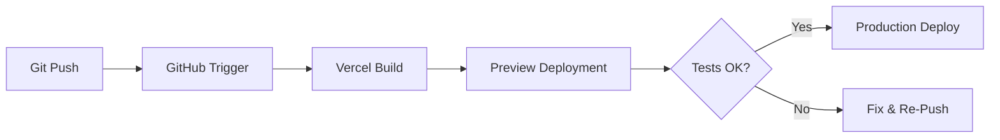

# Jambo Logistics – Projekt-Kontext & Analyse

**Analyse-Datum:** 30.10.2025  
**Analysiert von:** GitHub Copilot (Senior Software Architect)  
**Benchmark:** 360Volt-docu-MVP (Dokumentations-Standards)

---

## 1. Product Vision

### Hauptziel
Jambo Logistics ist eine **moderne Logistik-Plattform** für deutsch-kenianische Transportdienstleistungen (DE ↔ Kenya). Das Projekt startete als **Landing Page MVP** und entwickelt sich schrittweise zu einer vollständigen **CRM-Integration mit Tracking-Funktionalität**.

**Aktueller Status:** ✅ **Phase 1 (MVP) abgeschlossen** – Landing Page ist produktionsreif

### Evolutionspfad
```
Landing Page → Form Backend → Auth System → Admin Dashboard → CRM-Light → API Integration → Automation
```

### Kernfunktionen (MVP)
- ✅ Hero-Section mit Call-to-Action
- ✅ Service-Übersicht (3 Hauptservices)
- ✅ 3-Schritte-Prozess-Visualisierung
- ✅ About-Section mit Trust-Elementen
- ✅ Kontaktformular (derzeit Formspree, wird ersetzt)
- ✅ Footer mit Sprachumschaltung (DE/EN/SW)
- ✅ Responsive Design (Mobile-optimiert)
- ✅ Smooth Scrolling & Animationen (AOS)

### Zielgruppe
- **B2B-Kunden:** Unternehmen mit regelmäßigem DE↔Kenya Transportbedarf
- **B2C-Kunden:** Privatpersonen (Paketversand, Fahrzeugimport)
- **Geografischer Fokus:** Deutschland (NRW/Essen) ↔ Kenia (Nairobi)

### Unique Value Proposition
- **Persönlicher Service:** Kein anonymes Tracking, direkte Kommunikation
- **Kulturelle Brücke:** Deutsch-kenianisches Team, mehrsprachig (DE/EN/Kiswahili)
- **Transparenz:** Klarer 3-Schritte-Prozess, nachvollziehbare Preise
- **Lokale Präsenz:** Annahme in Essen (NRW), Zustellung in Nairobi

---

## 2. Tech-Stack (Stand: Oktober 2025)

### Frontend Framework
```json
{
  "react": "19.1.0",
  "typescript": "5.9.2",
  "vite": "6.3.5"
}
```

**Begründung für Tech-Wahl:**
- **React 19:** Neueste Version mit verbesserten Hooks, Concurrent Features
- **TypeScript 5.9:** Strict Mode aktiviert, Type-Safety garantiert
- **Vite 6:** Blitzschneller Dev-Server, optimiertes Production-Build

### Styling-Strategie
- **CSS Modules:** Scoped Styling, keine globalen Konflikte
- **CSS Custom Properties:** Zentrale Design-Tokens (`variables.css`)
- **Warmes Afrika-Theme:** Terracotta, Sage-Grün, warme Neutraltöne
- **No Tailwind/Sass:** Bewusste Entscheidung für native CSS (Performance, Wartbarkeit)

### UI-Bibliotheken
```json
{
  "@radix-ui/*": "^1.x.x",     // Accessible UI Primitives
  "framer-motion": "^12.15.0", // Animations (optional, AOS primär)
  "aos": "^2.3.4",             // Scroll-Animationen
  "lucide-react": "^0.510.0",  // Icon-System
  "zod": "^3.24.4",            // Schema-Validation (für Forms)
  "react-hook-form": "^7.56.3" // Form-Handling
}
```

**Besonderheit:** Radix UI-Komponenten sind vorhanden, aber **noch nicht voll integriert** (Vorbereitung für Dashboard-Phase)

### Build-Tools
- **Vite:** Fast HMR, Optimized Chunks
- **pnpm:** Package Manager (schneller als npm/yarn)
- **ESLint:** Code-Quality (`eslint:recommended`, TypeScript-Integration)
- **Prettier:** Code-Formatting (konfiguriert)

### Backend (Planned)
```
Option A: FastAPI (Python) – empfohlen für MVP
Option B: Express (Node.js) – wenn Node-Ökosystem bevorzugt
```

**Status:** Noch kein Backend (aktuell Formspree für Kontaktformular)

### Deployment
- **Plattform:** Vercel oder Netlify (noch nicht final gewählt)
- **CI/CD:** Auto-Deploy bei Git-Push (geplant)
- **Performance:** Lighthouse CI (geplant für Phase 2)

---

## 3. Ordnerstruktur-Analyse

### Aktuelle Organisation (✅ Gut strukturiert)

```
jambo-logistics/
├── public/
│   ├── assets/              # Statische Assets
│   └── logo.png
│
├── src/
│   ├── assets/              # Bilder (Hero, Services, Process, About)
│   ├── components/          # ✅ Reusable UI Components
│   │   ├── Header.tsx           → Navigation + Mobile Menu
│   │   ├── Hero.tsx             → Hero-Section mit CTA
│   │   ├── Services.tsx         → Service-Cards
│   │   ├── ProcessSteps.tsx     → 3-Schritte-Visualisierung
│   │   ├── AboutBox.tsx         → About-Section
│   │   ├── TrustSection.tsx     → Social Proof
│   │   ├── Contact.tsx          → Kontaktformular
│   │   ├── Footer.tsx           → Footer mit Links
│   │   ├── SectionDivider.tsx   → Visual Separators
│   │   └── ui/                  → Radix UI Primitives (bereit für Dashboard)
│   │
│   ├── hooks/               # Custom Hooks
│   │   ├── useActiveSection.ts  → Scroll-basierte Navigation
│   │   └── use-mobile.js        → Responsive Helper
│   │
│   ├── layouts/             # Layout-Container
│   │   └── DefaultLayout.tsx    → Wrapper mit Header/Footer
│   │
│   ├── styles/              # ✅ Zentrale Design-Tokens
│   │   ├── variables.css        → Design System (Primary SoT für Styling)
│   │   ├── base.css             → Reset + Basis-Styles
│   │   ├── components.module.css → Shared Component Styles
│   │   └── GlobalPolish.module.css → Polish-Layer
│   │
│   ├── utils/               # Hilfsfunktionen
│   │   └── animations.ts        → AOS-Config
│   │
│   ├── types/               # TypeScript Definitions
│   │   └── aos.d.ts             → AOS Type-Defs
│   │
│   ├── App.tsx              # Main Component (Section-Komposition)
│   ├── main.tsx             # Entry Point
│   └── index.css            # Global Imports
│
├── docs/                    # ✅ NEU: Dokumentation
│   └── PROJECT-CONTEXT.md   # Diese Datei
│
├── _unused_assets_backup/  # Temporäre Asset-Sicherung (kann gelöscht werden)
│
├── package.json
├── tsconfig.json            # ✅ Strict Mode aktiviert
├── vite.config.js
└── README.md
```

### Bewertung: Stärken & Verbesserungspotenzial

**✅ Stärken:**
1. **Klare Trennung:** Components, Layouts, Styles, Utils gut separiert
2. **CSS Modules:** Verhindert Style-Konflikte
3. **TypeScript Strict:** Bereits aktiviert (kein Nachholbedarf)
4. **Hooks-Pattern:** Custom Hooks für Logik-Wiederverwendung
5. **Zentrale Design-Tokens:** `variables.css` als Single Source of Truth

**⚠️ Verbesserungspotenzial:**
1. **Keine Tests:** Weder Unit- noch E2E-Tests vorhanden → Phase 2
2. **Keine API-Abstraktion:** Noch keine `/services` Layer (kommt mit Backend)
3. **Radix-UI ungenutzt:** UI-Komponenten vorhanden, aber nicht integriert (Dashboard-Vorbereitung)
4. **Keine Feature-Folders:** Aktuell component-basiert, später evtl. feature-basiert (`/features/contact`, `/features/tracking`)

### Empfohlene Erweiterungen (später)

```
src/
├── features/              # Feature-basierte Organisation (Phase 3+)
│   ├── contact/
│   │   ├── Contact.tsx
│   │   ├── ContactForm.tsx
│   │   └── contact.service.ts
│   ├── tracking/
│   └── dashboard/
│
├── services/              # API-Layer (Phase 2)
│   ├── api.ts            # Axios/Fetch-Wrapper
│   ├── contact.service.ts
│   └── tracking.service.ts
│
├── __tests__/            # Test-Organisation (Phase 2)
│   ├── unit/
│   └── e2e/
```

---

## 4. Deployment-Strategie

### Aktuelle Situation
- **Status:** Noch nicht deployed (Production-Ready, aber noch kein Live-Hosting)
- **Empfohlene Plattform:** Vercel (beste Vite-Integration, Auto-Deploy)
- **Alternative:** Netlify (ebenfalls gut, etwas weniger Features)

### Deployment-Workflow (geplant)



### CI/CD-Pipeline (Phase 2)

**GitHub Actions Workflow (geplant):**
```yaml
# .github/workflows/ci.yml
name: CI Pipeline
on: [push, pull_request]
jobs:
  lint:
    runs-on: ubuntu-latest
    steps:
      - name: Lint TypeScript
        run: pnpm run lint
  
  build:
    runs-on: ubuntu-latest
    steps:
      - name: Build Production
        run: pnpm run build
  
  lighthouse:
    runs-on: ubuntu-latest
    steps:
      - name: Lighthouse CI
        run: npx @lhci/cli autorun
```

### Performance-Ziele
- **Lighthouse Score:** >90 (alle Kategorien)
- **First Contentful Paint:** <1.5s
- **Time to Interactive:** <3s
- **Cumulative Layout Shift:** <0.1

---

## 5. Dokumentations-Status

### Bestehende Dokumentation
- ✅ **README.md:** Gute Übersicht (Setup, Features, Roadmap-Skizze)
- ✅ **PROJECT_SUMMARY.md:** Detaillierte Feature-Liste, Tech-Stack-Begründung
- ✅ **Code-Kommentare:** Teilweise vorhanden, aber inkonsistent

### Fehlende Dokumentation (zu erstellen)
- ❌ **ARCHITECTURE.md:** Tech-Stack-Details, Entscheidungsbegründungen
- ❌ **ROADMAP.md:** Konkrete Sprints mit Zeitschätzungen
- ❌ **CODING-STANDARDS.md:** TypeScript-Regeln, Naming-Conventions, Git-Workflow
- ❌ **TESTING-STRATEGY.md:** Test-Pyramide, Test-Tools, Coverage-Ziele
- ❌ **.github/copilot-instructions.md:** Copilot-Konfiguration
- ❌ **CHANGELOG.md:** Git-History-Tracking (noch leer)

**Ziel:** Nach 360Volt-Standard eine vollständige Dokumentations-Hierarchie aufbauen

---

## 6. Abhängigkeiten & Besonderheiten

### Kritische Dependencies
```json
{
  "react": "19.1.0",              // ⚠️ Neueste Version (noch wenig Adoption)
  "typescript": "5.9.2",          // ✅ Stabil
  "vite": "6.3.5",                // ⚠️ Sehr neu (Dezember 2024)
  "@radix-ui/*": "1.x.x",         // ✅ Stabil
  "aos": "2.3.4"                  // ⚠️ Alte Library (aber stabil)
}
```

**Risiken:**
- **React 19:** Neue Version, mögliche Breaking Changes in Drittanbieter-Libraries
- **Vite 6:** Sehr neu, potenzielle Plugin-Inkompatibilitäten

**Mitigation:**
- Regelmäßige Dependency-Updates testen
- Lock-Files committen (pnpm-lock.yaml)
- Changelog-Monitoring für Breaking Changes

### Besondere Features
1. **Smooth Scrolling mit Active-Section-Tracking:**
   - Custom Hook `useActiveSection.ts`
   - Viewport-basierte Erkennung (robuster als Intersection Observer)
   - Header-Offset-Kompensation (96px)

2. **Multi-Language-Support (vorbereitet):**
   - Language-Switcher im Header (DE/EN/SW)
   - Noch keine i18n-Library (statischer Content derzeit)
   - Vorbereitung für `react-i18next` in Phase 2

3. **Mobile-First, aber Desktop-optimiert:**
   - Breakpoints: 768px (md), 1024px (lg), 1200px (xl)
   - Mobile Overlay-Menü (Fullscreen)
   - Touch-optimierte Interaktionen

---

## 7. Nächste Schritte (Quick Wins)

### Kurzfristig (Sprint 1 – 2 Wochen)
1. **Formular-Backend implementieren:**
   - Formspree entfernen
   - FastAPI Endpoint: `POST /api/contact`
   - E-Mail-Versand mit AWS SES oder Nodemailer
   - Validation mit Zod

2. **Testing-Setup:**
   - Vitest für Unit-Tests
   - Playwright für E2E-Tests
   - Basis-Tests für kritische Komponenten

3. **Deployment:**
   - Vercel-Konto einrichten
   - GitHub-Integration
   - Erste Production-Deployment

### Mittelfristig (Sprint 2-3 – 4 Wochen)
1. **Auth-System:**
   - Clerk oder Firebase Auth
   - Protected Routes
   - User-Profile

2. **Admin-Dashboard:**
   - CRUD für Contact-Requests
   - Status-Tracking
   - Radix-UI Integration nutzen

### Langfristig (Sprint 4+ – 3 Monate)
1. **CRM-Integration:**
   - Airtable oder eigenes CRM
   - Customer Management

2. **Tracking-API:**
   - Shipment-Tracking
   - Status-Updates

3. **Automatisierung:**
   - n8n/Make/Zapier Workflows

---

## 8. Learnings & Empfehlungen

### Was läuft gut
- ✅ **Klare Architektur:** Gut strukturiert, wartbar
- ✅ **TypeScript Strict:** Weniger Bugs, bessere DX
- ✅ **CSS Modules:** Skalierbar, keine Konflikte
- ✅ **Moderne Tools:** Vite, React 19, pnpm

### Was verbessert werden kann
- ⚠️ **Keine Tests:** Kritisch für Skalierung
- ⚠️ **Keine Dokumentation:** Onboarding schwierig
- ⚠️ **Keine CI/CD:** Manuelle Deployments fehleranfällig
- ⚠️ **Keine Pre-Commit-Hooks:** Code-Quality nicht automatisiert

### Empfehlungen (nach 360Volt-Vorbild)
1. **Husky + lint-staged einrichten:**
   ```bash
   pnpm add -D husky lint-staged
   npx husky install
   ```

2. **Conventional Commits durchsetzen:**
   ```bash
   pnpm add -D @commitlint/cli @commitlint/config-conventional
   ```

3. **CHANGELOG.md automatisieren:**
   ```bash
   pnpm add -D standard-version
   ```

4. **Dokumentation leben lassen:**
   - `/docs` als Primary Source of Truth
   - Bei jedem Feature-Update: Docs aktualisieren
   - Copilot-Instructions pflegen

---

## 9. Fazit

**Jambo Logistics ist ein solides MVP mit klarer Vision und moderner Tech-Basis.**

**Stärken:**
- ✅ Production-ready Frontend
- ✅ Moderne, wartbare Architektur
- ✅ TypeScript Strict Mode aktiviert
- ✅ Gute UX/UI (warm, vertrauenswürdig, responsiv)

**Schwächen:**
- ❌ Keine Tests
- ❌ Keine strukturierte Dokumentation
- ❌ Kein Backend (Formspree temporär)
- ❌ Keine CI/CD

**Empfehlung:**  
Fokus auf **Dokumentation + Testing + Backend** in Phase 2. Danach ist das Projekt bereit für Skalierung (Dashboard, CRM, Tracking).

---

**Nächster Schritt:** Erstelle `/docs/ARCHITECTURE.md` mit detaillierter Tech-Stack-Dokumentation.
