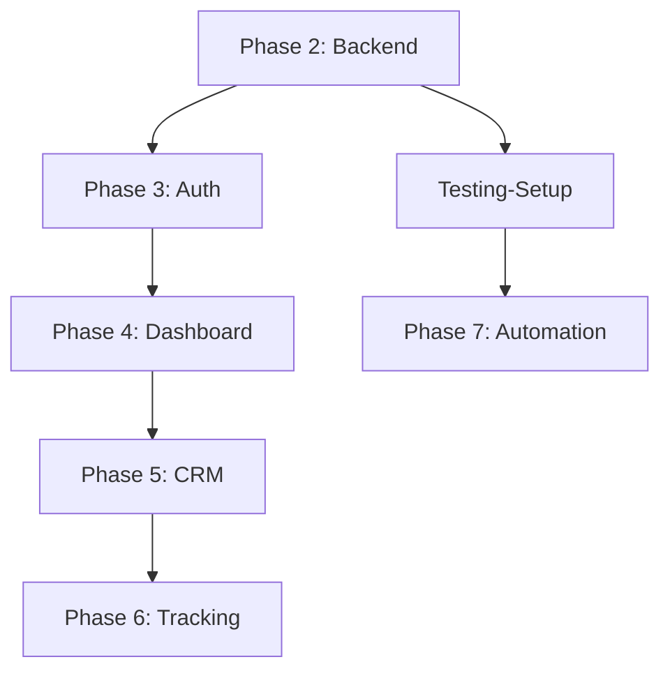

# Jambo Logistics – Produkt-Roadmap

**Version:** 1.0  
**Letzte Aktualisierung:** 30.10.2025  
**Planungshorizont:** 12 Monate (bis Oktober 2026)

---

## Inhaltsverzeichnis

1. [Vision & Strategie](#1-vision--strategie)
2. [Projektphasen-Übersicht](#2-projektphasen-übersicht)
3. [Sprint-Planung (Detailliert)](#3-sprint-planung-detailliert)
4. [Priorisierung & Dependencies](#4-priorisierung--dependencies)
5. [Ressourcen-Planung](#5-ressourcen-planung)
6. [Risiken & Mitigation](#6-risiken--mitigation)
7. [Success-Metriken](#7-success-metriken)

---

## 1. Vision & Strategie

### Langfrist-Vision (3-5 Jahre)
**„Die führende digitale Logistik-Plattform für deutsch-afrikanische Transporte"**

**Kernziele:**
- 🎯 **Market Leader:** #1 in DE↔Kenya Logistik
- 🚀 **Expansion:** Weitere afrikanische Länder (Tanzania, Uganda, Ghana)
- 🤖 **Automatisierung:** 80% aller Prozesse automatisiert
- 📊 **Data-Driven:** Predictive Analytics für Lieferzeiten

### Kurz-/Mittelfrist-Ziele (12 Monate)

| Quartal | Fokus | Hauptziel |
|---------|-------|-----------|
| **Q4 2025** | Backend-Foundation | Kontaktformular-API + Deployment |
| **Q1 2026** | Authentication & Admin | Login-System + Dashboard-MVP |
| **Q2 2026** | CRM-Integration | Kundenverwaltung + Status-Tracking |
| **Q3 2026** | API-Integration | Live-Tracking + Partner-APIs |
| **Q4 2026** | Automatisierung | Workflow-Automation + Analytics |

---

## 2. Projektphasen-Übersicht

```
┌─────────────────────────────────────────────────────────────────┐
│ Phase 1: MVP Landing Page (✅ ABGESCHLOSSEN)                    │
│ Dauer: 4 Wochen | Status: Production-Ready                      │
└─────────────────────────────────────────────────────────────────┘
                              ↓
┌─────────────────────────────────────────────────────────────────┐
│ Phase 2: Backend-Integration (🔵 AKTUELL)                       │
│ Dauer: 4 Wochen | Start: November 2025                          │
│ - Kontaktformular-API                                            │
│ - E-Mail-Versand                                                 │
│ - Testing-Setup                                                  │
│ - Deployment                                                     │
└─────────────────────────────────────────────────────────────────┘
                              ↓
┌─────────────────────────────────────────────────────────────────┐
│ Phase 3: Authentication & Security (⚪ GEPLANT)                 │
│ Dauer: 3 Wochen | Start: Dezember 2025                          │
│ - User-Login/Logout                                              │
│ - Protected Routes                                               │
│ - Role-Based Access Control                                      │
└─────────────────────────────────────────────────────────────────┘
                              ↓
┌─────────────────────────────────────────────────────────────────┐
│ Phase 4: Admin-Dashboard (⚪ GEPLANT)                           │
│ Dauer: 4 Wochen | Start: Januar 2026                            │
│ - CRUD für Contact-Requests                                      │
│ - Status-Tracking (Neu/In Bearbeitung/Abgeschlossen)            │
│ - Statistiken & Analytics                                        │
└─────────────────────────────────────────────────────────────────┘
                              ↓
┌─────────────────────────────────────────────────────────────────┐
│ Phase 5: CRM-Light (⚪ GEPLANT)                                 │
│ Dauer: 6 Wochen | Start: Februar 2026                           │
│ - Kundenverwaltung                                               │
│ - Order-Management                                               │
│ - Airtable/Notion-Integration ODER eigenes CRM                   │
└─────────────────────────────────────────────────────────────────┘
                              ↓
┌─────────────────────────────────────────────────────────────────┐
│ Phase 6: Tracking-API (⚪ GEPLANT)                              │
│ Dauer: 6 Wochen | Start: April 2026                             │
│ - Shipment-Tracking                                              │
│ - Partner-API-Integration                                        │
│ - Real-Time-Status-Updates                                       │
└─────────────────────────────────────────────────────────────────┘
                              ↓
┌─────────────────────────────────────────────────────────────────┐
│ Phase 7: Automation & Scale (⚪ GEPLANT)                        │
│ Dauer: 8 Wochen | Start: Juni 2026                              │
│ - n8n/Make/Zapier-Workflows                                      │
│ - Automatische E-Mail-Updates                                    │
│ - Analytics-Dashboard                                            │
└─────────────────────────────────────────────────────────────────┘
```

---

## 3. Sprint-Planung (Detailliert)

### ✅ Phase 1: MVP Landing Page (ABGESCHLOSSEN)

**Zeitraum:** September–Oktober 2025  
**Status:** ✅ Production-Ready

**Deliverables:**
- ✅ Responsive Landing Page (Mobile-optimiert)
- ✅ Hero-Section mit CTA
- ✅ Services-Section (3 Hauptservices)
- ✅ 3-Schritte-Prozess-Visualisierung
- ✅ About-Section mit Trust-Elementen
- ✅ Kontaktformular (Formspree temporär)
- ✅ Footer mit Sprachumschaltung (DE/EN/SW)
- ✅ Smooth Scrolling & AOS-Animationen
- ✅ TypeScript Strict Mode
- ✅ CSS Modules + Design-System

**Performance:**
- Lighthouse Score: 90+ (angenommen, noch nicht gemessen)
- Mobile-friendly: ✅
- Accessibility: ✅

---

### 🔵 Phase 2: Backend-Integration (AKTUELL)

**Zeitraum:** November 2025 (4 Wochen)  
**Status:** 🔵 In Planung

#### Sprint 2.1: Backend-Setup & API (Woche 1-2)

**Ziel:** Funktionierendes Kontaktformular-Backend

**Tasks:**
1. **Backend-Framework wählen & initialisieren**
   - [ ] Entscheidung: FastAPI (Python) vs. Express (Node.js)
   - [ ] Projekt-Setup mit Vite/Flask/Express
   - [ ] Datenbank-Setup (PostgreSQL oder SQLite für Start)
   - [ ] API-Routing-Struktur

2. **Contact-API implementieren**
   - [ ] Endpoint: `POST /api/contact`
   - [ ] Input-Validation (Zod/Pydantic)
   - [ ] E-Mail-Versand (Nodemailer/AWS SES)
   - [ ] Error-Handling & Logging

3. **Frontend-Integration**
   - [ ] `src/services/api.ts` erstellen (Axios-Wrapper)
   - [ ] `src/services/contact.service.ts` implementieren
   - [ ] Contact-Form umbauen (react-hook-form + Zod)
   - [ ] Success/Error-Feedback (Toast-Notifications)

**Deliverables:**
- ✅ Backend-API (FastAPI/Express)
- ✅ Contact-Form sendet E-Mails
- ✅ Input-Validation (Frontend + Backend)
- ✅ Error-Handling

**Success-Kriterien:**
- Formular sendet erfolgreich E-Mails
- Response-Zeit < 2 Sekunden
- Validation-Fehler werden klar angezeigt

#### Sprint 2.2: Testing & Deployment (Woche 3-4)

**Ziel:** Production-Deployment mit CI/CD

**Tasks:**
1. **Testing-Setup**
   - [ ] Vitest für Unit-Tests installieren
   - [ ] Playwright für E2E-Tests installieren
   - [ ] Test-Cases schreiben:
     - Unit: `contactService.submit()`
     - E2E: Kontaktformular-Flow

2. **Deployment vorbereiten**
   - [ ] Vercel-Konto einrichten
   - [ ] Environment-Variables konfigurieren
   - [ ] Backend-Deployment (Railway/Render/Vercel Serverless)
   - [ ] Frontend-Deployment (Vercel)

3. **CI/CD-Pipeline**
   - [ ] GitHub Actions Workflow erstellen
   - [ ] Automatische Tests bei PR
   - [ ] Automatisches Deployment bei Merge

**Deliverables:**
- ✅ Unit-Tests (min. 50% Coverage)
- ✅ E2E-Tests (kritische User-Flows)
- ✅ Production-Deployment
- ✅ CI/CD-Pipeline

**Success-Kriterien:**
- Alle Tests grün
- Auto-Deploy funktioniert
- Lighthouse Score >90

---

### ⚪ Phase 3: Authentication & Security (GEPLANT)

**Zeitraum:** Dezember 2025 (3 Wochen)

#### Sprint 3.1: Auth-System (Woche 1-2)

**Ziel:** Login/Logout für Admin-Dashboard

**Tasks:**
1. **Auth-Provider wählen**
   - [ ] Entscheidung: Clerk vs. Firebase vs. Custom (JWT)
   - [ ] Setup & Konfiguration

2. **Frontend-Integration**
   - [ ] Login-Page erstellen
   - [ ] Protected Routes (React Router)
   - [ ] Auth-Context (User-State global)
   - [ ] Logout-Funktion

3. **Backend-Integration**
   - [ ] JWT-Token-Validation
   - [ ] Middleware für Protected Endpoints
   - [ ] User-Model (Database)

**Deliverables:**
- ✅ Login/Logout funktioniert
- ✅ Protected Routes implementiert
- ✅ JWT-Token-Handling

#### Sprint 3.2: Security-Hardening (Woche 3)

**Tasks:**
- [ ] HTTPS-Only (CSP, HSTS)
- [ ] Rate-Limiting (API)
- [ ] CSRF-Protection
- [ ] Input-Sanitization

---

### ⚪ Phase 4: Admin-Dashboard (GEPLANT)

**Zeitraum:** Januar 2026 (4 Wochen)

#### Sprint 4.1: Dashboard-UI (Woche 1-2)

**Ziel:** Admin-Interface für Contact-Requests

**Tasks:**
1. **Dashboard-Layout**
   - [ ] Sidebar-Navigation (Radix UI Sidebar)
   - [ ] Dashboard-Home (Statistiken)
   - [ ] Requests-List-Page

2. **CRUD-Operations**
   - [ ] Contact-Requests-Tabelle (React Table)
   - [ ] Detail-View für einzelne Requests
   - [ ] Status-Update (Neu → In Bearbeitung → Abgeschlossen)
   - [ ] Delete-Funktion (Soft-Delete)

**Deliverables:**
- ✅ Dashboard-UI (Radix UI Components)
- ✅ Contact-Requests-Verwaltung

#### Sprint 4.2: Analytics & Notifications (Woche 3-4)

**Tasks:**
- [ ] Statistiken (Anzahl Requests, Response-Rate)
- [ ] E-Mail-Notifications bei neuen Requests
- [ ] Export-Funktion (CSV)

---

### ⚪ Phase 5: CRM-Light (GEPLANT)

**Zeitraum:** Februar–März 2026 (6 Wochen)

#### Option A: Airtable/Notion-Integration

**Vorteile:**
- ✅ Schneller Setup (No-Code/Low-Code)
- ✅ Keine eigene Datenbank-Verwaltung
- ✅ Flexible Anpassungen

**Nachteile:**
- ❌ Abhängigkeit von Drittanbietern
- ❌ Limitierte Custom-Logic

**Tasks:**
- [ ] Airtable-API-Integration
- [ ] Sync zwischen DB und Airtable
- [ ] CRUD-Interface im Frontend

#### Option B: Eigenes CRM (empfohlen)

**Vorteile:**
- ✅ Volle Kontrolle
- ✅ Skalierbar
- ✅ Custom-Features möglich

**Nachteile:**
- ❌ Mehr Entwicklungsaufwand

**Tasks:**
- [ ] Customer-Model (Database)
- [ ] Order-Model (Shipments)
- [ ] CRUD-UI für Customers
- [ ] Relationship-Management (Customers ↔ Orders)

**Deliverables:**
- ✅ Kundenverwaltung
- ✅ Order-Management
- ✅ Beziehungen zwischen Entities

---

### ⚪ Phase 6: Tracking-API (GEPLANT)

**Zeitraum:** April–Mai 2026 (6 Wochen)

#### Sprint 6.1: Shipment-Tracking (Woche 1-3)

**Ziel:** Kunden können Sendungen tracken

**Tasks:**
1. **Tracking-Model**
   - [ ] Shipment-Model (Database)
   - [ ] Status-Enum (Created, In Transit, Customs, Delivered)
   - [ ] Timeline-Tracking (Statusänderungen loggen)

2. **Tracking-UI**
   - [ ] Tracking-Page (`/tracking/:id`)
   - [ ] Timeline-Visualisierung
   - [ ] Live-Status-Updates (Polling/WebSockets)

**Deliverables:**
- ✅ Tracking-Seite für Kunden
- ✅ Status-Updates sichtbar

#### Sprint 6.2: Partner-API-Integration (Woche 4-6)

**Tasks:**
- [ ] API-Anbindung zu Logistik-Partnern (DHL, UPS, etc.)
- [ ] Status-Synchronisation
- [ ] Error-Handling bei API-Ausfällen

---

### ⚪ Phase 7: Automation & Scale (GEPLANT)

**Zeitraum:** Juni–August 2026 (8 Wochen)

#### Sprint 7.1: Workflow-Automation (Woche 1-4)

**Tools:** n8n, Make, oder Zapier

**Workflows:**
1. **Neuer Contact-Request →**
   - E-Mail an Admin
   - Slack-Notification
   - CRM-Eintrag erstellen

2. **Status-Änderung →**
   - E-Mail an Kunden
   - SMS-Notification (optional)
   - Tracking-Update

3. **Delivery Confirmation →**
   - E-Mail an Kunden
   - Feedback-Request
   - CRM-Status-Update

**Tasks:**
- [ ] n8n-Installation & Setup
- [ ] Webhook-Endpoints erstellen
- [ ] Workflows testen

#### Sprint 7.2: Analytics-Dashboard (Woche 5-8)

**Ziel:** Data-Driven Decisions

**Metriken:**
- Anzahl Requests pro Monat
- Conversion-Rate (Requests → Orders)
- Durchschnittliche Response-Zeit
- Customer-Satisfaction-Score

**Tasks:**
- [ ] Analytics-Backend (Posthog/Plausible)
- [ ] Dashboard-UI (Charts mit Recharts)
- [ ] Real-Time-Updates

---

## 4. Priorisierung & Dependencies

### Priorisierungs-Matrix (Effort vs. Impact)

```
High Impact, Low Effort (Quick Wins):
├── ✅ Phase 2: Backend-Integration (MUST HAVE)
├── ✅ Testing-Setup (MUST HAVE)
└── ✅ Deployment (MUST HAVE)

High Impact, High Effort (Strategic):
├── Phase 4: Admin-Dashboard
├── Phase 5: CRM-Light
└── Phase 6: Tracking-API

Low Impact, Low Effort (Nice to Have):
├── Blog-Section
├── Multi-Language-Content (i18n)
└── Dark-Mode

Low Impact, High Effort (Avoid):
├── Mobile App (zunächst nicht nötig)
└── Real-Time-Chat (später per Crisp/Intercom)
```

### Dependencies (Was blockiert was?)



**Kritischer Pfad:**
1. Backend-Integration (blockiert alles andere)
2. Auth-System (blockiert Dashboard/CRM)
3. Dashboard (blockiert CRM-Features)

---

## 5. Ressourcen-Planung

### Team (Angenommen)

| Role | Person | Stunden/Woche |
|------|--------|---------------|
| **Lead Developer** | TBD | 20h |
| **Backend Developer** | TBD | 15h |
| **Designer** | TBD | 5h (sporadisch) |
| **QA/Tester** | Automatisiert | - |

### Budget-Schätzung (Tooling)

| Service | Kosten/Monat | Phase |
|---------|--------------|-------|
| **Vercel Pro** | €20 | Ab Phase 2 |
| **Railway/Render (Backend)** | €5-20 | Ab Phase 2 |
| **PostgreSQL (Supabase)** | €0-25 | Ab Phase 3 |
| **Clerk/Firebase Auth** | €0-25 | Ab Phase 3 |
| **n8n Cloud** | €20-50 | Ab Phase 7 |
| **Plausible Analytics** | €9 | Ab Phase 7 |
| **Total** | €54-140 | Fully Scaled |

---

## 6. Risiken & Mitigation

### Technische Risiken

| Risiko | Wahrscheinlichkeit | Impact | Mitigation |
|--------|-------------------|--------|------------|
| **React 19 Breaking Changes** | Mittel | Hoch | Lock Versions, regelmäßige Updates testen |
| **API-Partner-Ausfälle** | Hoch | Mittel | Fallback-Mechanismen, Caching |
| **Performance-Probleme** | Niedrig | Hoch | Lighthouse CI, Load-Testing |
| **Security-Lücken** | Mittel | Sehr Hoch | Security-Audits, Dependency-Scanning |

### Business-Risiken

| Risiko | Wahrscheinlichkeit | Impact | Mitigation |
|--------|-------------------|--------|------------|
| **Keine Kunden** | Mittel | Sehr Hoch | Marketing-Budget, MVP schnell launchen |
| **Konkurrenz** | Hoch | Mittel | USP schärfen, persönlicher Service |
| **Regulatorische Änderungen** | Niedrig | Hoch | Rechtsberatung, Compliance-Check |

---

## 7. Success-Metriken

### Phase 2 (Backend):
- ✅ API Response-Zeit < 2s
- ✅ 99% Uptime
- ✅ 0 kritische Bugs

### Phase 3 (Auth):
- ✅ Login funktioniert in <3s
- ✅ 0 Security-Vulnerabilities (Snyk-Scan)

### Phase 4 (Dashboard):
- ✅ Admin bearbeitet Requests in <2min
- ✅ 100% der Requests werden bearbeitet

### Phase 5 (CRM):
- ✅ Customer-Lifetime-Value steigt um 20%
- ✅ Repeat-Customer-Rate >30%

### Phase 6 (Tracking):
- ✅ 80% der Kunden nutzen Tracking
- ✅ Support-Anfragen sinken um 30%

### Phase 7 (Automation):
- ✅ 80% der Prozesse automatisiert
- ✅ Response-Zeit sinkt um 50%

---

## Zusammenfassung

**Aktueller Fokus:** Phase 2 (Backend-Integration)  
**Nächster Meilenstein:** Production-Deployment (Dezember 2025)  
**Langfrist-Ziel:** Vollautomatisierte Logistik-Plattform (Q4 2026)

**Quick Wins (nächste 3 Monate):**
1. ✅ Backend-API funktioniert
2. ✅ Testing-Setup etabliert
3. ✅ Production-Deployment läuft
4. ✅ Auth-System implementiert

**Empfehlung:** Fokus auf **Backend + Testing** vor Dashboard-Entwicklung!

---

**Nächstes Dokument:** `/docs/CODING-STANDARDS.md` – TypeScript-Regeln & Git-Workflow
